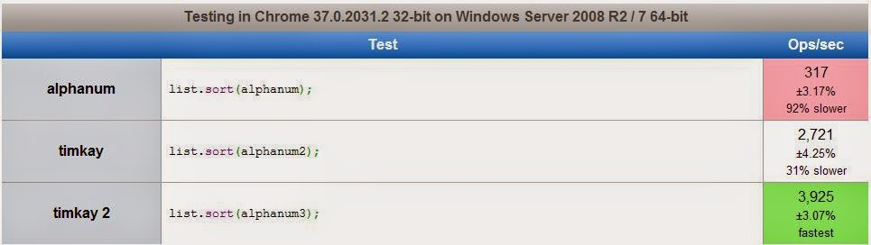

# Fast Alphanum Algorithm

The Alphanum algorithm sorts strings "the right way". By default, most sorting is done lexicographically, which means that you sort two strings based on the left-most character in each string that do not match. Ted comes before Tim because e comes before i. Also, A100 comes before A2 because 1 comes before 2. You've probably seen files sorted this way before:

    A1
    A10
    A11
    A2
    A3
    A4
    A5
    A6
    A7
    A8
    A9

You want to see it sorted this way:

    A1
    A2
    A3
    A4
    A5
    A6
    A7
    A8
    A9
    A10
    A11

That's where the Alphanum algorithm comes in. It compares two strings in a smarter way, so that you get the second result above, not the first.

Now ask yourself how should these strings be sorted?

    x3
    xy
    x
    x3
    x2
    x23
    000
    01
    009
    01
    2x
    2
    #2x
    #20
    #2
    40003
    4000000000002
    0000000000003
    00003
    000034
    xyz40003q
    xyz4000000000002q
    xyz0000000000003q
    xyz00003q
    xyz000034q
    00000
    00000000000000000000000
    0
    (empty string)

Which comes first, 0, 00000, or 00000000000000000000000 ? Let's say that numbers representing the same value should be sorted shortest first.

I wrote my alphanum algorithm a long, long time ago. It was slow, so I rewrote it, and now it's really fast. I published it, in the sense that it is used in various websites, but I never wrote it up. Why write it up now?

I just came across various implementations of alphanum collected by Dave Koelle at http://www.davekoelle.com/alphanum.html. So it's out there. And his versions seem to be pretty popular. There are a great many discussions about his collection.

Unfortunately, the code is pretty slow. The implementations use a "chunkify" approach, which converts each string into separate alpha and numeric parts. That's a whole lot of computation and memory management, which is slow.

My first implementation of alphanum did something similar, but I eventually moved past it. I found it is possible to write alphanum to do a single pass over the data, comparing the two strings in place, which is much faster. (In fact, this version is O(N), the same as lexicographic string comparison, so this version could potentially run the same speed as lexicographic string comparison.) Comparing to Dave's JavaScript version, mine runs about 9 times faster. (More on that later.) The code is also simpler, at least until the final optimized version. Here it is.
    function alphanum(a, b) {

        function isdigit(ch) {
            return '0' <= ch &amp;&amp; ch <= '9';
        }

        var min = Math.min(a.length, b.length);

        for (var i = 0; i < min; i++) {
            if (a.charCodeAt(i) !== b.charCodeAt(i)) break;
        }

        if (i == min) return a.length - b.length;
        var cmp = a.charCodeAt(i) - b.charCodeAt(i);

        if (isdigit(a[i - 1]) || isdigit(a[i]) &amp;&amp; isdigit(b[i])) {
            for (;; i++) {
                var ai = isdigit(a[i]);
                var bi = isdigit(b[i]);
                if (ai !== bi) return ai - bi;
                if (!ai || !bi) break;
            }
        }

        return cmp;
    }

Try it here: http://jsfiddle.net/SpP65/. The example uses the data set from Dave's page.

One problem: there is an important case that my code does not handle. See if you can figure it out. (It's tricky.)

==== SPOILER ====

I found Dave's page and saw that the algorithm was slow. However, my version didn't handle a significant case properly: numbers with leading zeros. How should frame2, frame3, and frame002 sort? It's obvious that frame002 belongs between the other two, but the code above doesn't do that.

For years I have been pondering how to fix my code while keeping it simple and fast. Today I figured it out. Unfortunately, I didn't manage to keep it simple. But the change to support leading zeros made the code even faster!

The approach: given all the edge conditions, I decided to simply blow out the code into a bunch of special cases, to deal with each edge condition separately. This way, you get lots of code, but only one code path runs for each case, so it's very fast. Here it is.
    function alphanum(a, b) {
        
        function isdigit(ch) {
            return '0' <= ch &amp;&amp; ch <= '9';
        }
        
        var min = Math.min(a.length, b.length);
        
        for (var i = 0; i < min; i++) {
            if (a.charCodeAt(i) !== b.charCodeAt(i)) break;
        }
        
        if (i == min) return a.length - b.length;
        
        if (isdigit(a[i])) {
            if (isdigit(b[i])) {
                if (a[i] === '0' || b[i] === '0') {
                    for (var z = i - 1; z > 0; z--) {
                        if (a[z] !== '0') break;
                    }
                    if (!isdigit(a[z])) z++;
                    if (a[z] === '0' || b[z] === '0') {
                        for (var j = i; ; j++) {
                            if (b[j] !== '0') break;
                        }
                        for (;; i++) {
                            if (a[i] !== '0') break;
                        }
                        if (!isdigit(a[i])) {
                            if (isdigit(b[j])) {
                                return -1;
                            } else {
                                return i - j;
                            }
                        } else if (!isdigit(b[j])) {
                            return 1;
                        } else {
                            var cmp = a.charCodeAt(i) - b.charCodeAt(j);
                            for (i++, j++;; i++, j++) {
                                if (!isdigit(a[i])) {
                                    if (isdigit(b[j])) {
                                        return -1;
                                    } else {
                                        if (cmp) return cmp;
                                        return i - j;
                                    }
                                } else if (!isdigit(b[j])) {
                                    return 1;
                                }
                            }
                        }
                    }
                }
                
                var cmp = a.charCodeAt(i) - b.charCodeAt(i);
                for (i++;; i++) {
                    if (!isdigit(a[i])) {
                        if (isdigit(b[i])) {
                            return -1;
                        } else {
                            return cmp;
                        }
                    } else if (!isdigit(b[i])) {
                        return 1;
                    }
                }
            } else if (isdigit(a[i - 1])) {
                return 1;
            } else {
                return a.charCodeAt(i) - b.charCodeAt(i);
            }
        } else if (isdigit(b[i])) {
            if (isdigit(b[i - 1])) {
                return -1;
            } else {
                return a.charCodeAt(i) - b.charCodeAt(i);
            }
        } else {
            return a.charCodeAt(i) - b.charCodeAt(i);
        }
    }
    
    $('#a').text([
        '1000X Radonius Maximus',
        '10X Radonius',
        '200X Radonius',
        '20X Radonius',
        '20X Radonius Prime',
        '30X Radonius',
        '40X Radonius',
        'Allegia 50 Clasteron',
        'Allegia 500 Clasteron',
        'Allegia 50B Clasteron',
        'Allegia 51 Clasteron',
        'Allegia 6R Clasteron',
        'Alpha 100',
        'Alpha 2',
        'Alpha 200',
        'Alpha 2A',
        'Alpha 2A-8000',
        'Alpha 2A-900',
        'Callisto Morphamax',
        'Callisto Morphamax 500',
        'Callisto Morphamax 5000',
        'Callisto Morphamax 600',
        'Callisto Morphamax 6000 SE',
        'Callisto Morphamax 6000 SE2',
        'Callisto Morphamax 700',
        'Callisto Morphamax 7000',
        'Xiph Xlater 10000',
        'Xiph Xlater 2000',
        'Xiph Xlater 300',
        'Xiph Xlater 40',
        'Xiph Xlater 5',
        'Xiph Xlater 50',
        'Xiph Xlater 500',
        'Xiph Xlater 5000',
        'Xiph Xlater 58'
    ].sort(alphanum).join("\n"));
    
    $('#b').text([
        'x3', 'xy', 'x', 'x3', 'x2', 'x23',
        '000', '01', '009', '01',
        '2x', '2', '#2x', '#20', '#2',
        '40003', '4000000000002', '0000000000003', '00003', '000034',
        'xyz40003q', 'xyz4000000000002q', 'xyz0000000000003q', 'xyz00003q', 'xyz000034q',
        '00000', '00000000000000000000000', '0', ''
    ].sort(alphanum).join("\n"));

Try the new code: http://jsfiddle.net/nz6uU/3/

I find it fascinating how complicated the code got. There is nothing surprising in the code, just a lot of it. To understand it, pick various cases and follow the code through.

And how fast is it? See the benchmark: http://jsperf.com/alphanum/4. The first is Dave's alphanum. The second, named "timkay" is the broken (but simple) version, and the last, named "timkay 2" is the optimized version.

The version that handles leading zeros correctly also runs over 10x faster than the chunkify version. Sweet!
